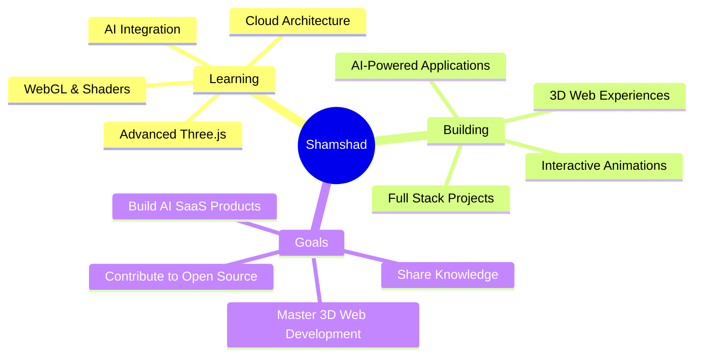

<div align="center">

<!-- Working Animated Header -->


<!-- Working Typing Effect -->


<!-- Working Profile Views Counter -->
<p align="center">
  
  
</p>

<!-- Animated Divider -->


</div>

<!-- About Me Section -->
<div align="center">

##  About Me


```javascript
const shamshad = {
    pronouns: "He" | "Him",
    location: "India 🇮🇳",
    role: "Full Stack Developer",
    specialties: ["3D Web Development", "AI Integration", "React.js"],
    technologies: {
        frontEnd: ["React", "Next.js", "Three.js", "GSAP", "Tailwind CSS"],
        backEnd: ["Node.js", "Express", "Spring Boot"],
        databases: ["MongoDB", "MySQL", "Firebase"],
        ai: ["Gemini AI", "OpenAI"],
        tools: ["Git", "Linux", "VS Code"]
    },
    currentFocus: "Building immersive 3D web experiences & AI-powered apps",
    funFact: "I turn coffee into 3D magic ☕ → 🎨"
};
```

</div>


<div align="center">

##  Tech Stack & Tools


<details open>
<summary><b>🎨 Frontend Development</b></summary>
<br>
<p align="center">
  
</p>
<p align="center">
  
  
  
  
  
  
  
</p>
</details>


<details open>
<summary><b>⚙️ Backend Development</b></summary>
<br>
<p align="center">
  
</p>
<p align="center">
  
  
  
  
</p>
</details>


<details open>
<summary><b>🤖 AI & Databases</b></summary>
<br>
<p align="center">
  
</p>
<p align="center">
  
  
  
  
</p>
</details>

</div>


<div align="center">

##  GitHub Analytics


<p align="center">
  
  
</p>


<p align="center">
  
</p>


</div>


<div align="center">

##  Featured Projects

<table>
<tr>
<td width="50%">
<h3 align="center">🍎 3D Apple Promo Website</h3>
<div align="center">  
<a href="https://main--heroic-strudel-af4df6.netlify.app/" target="_blank">

</a>
<br><br>
<p><strong>🎨 Immersive 3D Experience</strong></p>
<p>Built a stunning 3D Apple promo website using React.js, Tailwind CSS, GSAP, and Three.js, delivering an immersive and interactive user experience.</p>
<p>


</p>
<a href="https://main--heroic-strudel-af4df6.netlify.app/" target="_blank">

</a>
</div>
</td>
<td width="50%">
<h3 align="center">🤖 AI Trip Planner</h3>
<div align="center">  
<a href="https://ai-trip-planner-alpha.vercel.app/" target="_blank">

</a>
<br><br>
<p><strong>🧠 AI-Powered Travel Planning</strong></p>
<p>Built a generative AI trip planner using Gemini, React.js, and Firebase to create personalized itineraries with Google OAuth integration.</p>
<p>


</p>
<a href="https://ai-trip-planner-alpha.vercel.app/" target="_blank">

</a>
</div>
</td>
</tr>
<tr>
<td width="50%">
<h3 align="center">📋 TaskFlow</h3>
<div align="center">  
<a href="https://taskflow03.netlify.app/" target="_blank">

</a>
<br><br>
<p><strong>⚡ Advanced Task Management</strong></p>
<p>A comprehensive task management system with React.js, Spring Boot, featuring drag-and-drop functionality, role-based authentication, and CRUD operations.</p>
<p>


</p>
<a href="https://taskflow03.netlify.app/" target="_blank">

</a>
</div>
</td>
<td width="50%">
<h3 align="center">🎭 Ochi Website Clone</h3>
<div align="center">  
<a href="https://ochi-react-animated.netlify.app/" target="_blank">

</a>
<br><br>
<p><strong>🎨 Premium Animation Experience</strong></p>
<p>A visually engaging clone of the Ochi website built with React, Tailwind CSS, GSAP, and Framer Motion for smooth animations.</p>
<p>


</p>
<a href="https://ochi-react-animated.netlify.app/" target="_blank">

</a>
</div>
</td>
</tr>
<tr>
<td width="50%">
<h3 align="center">📍 Real-Time Location Tracker</h3>
<div align="center">  
<a href="https://realtime-tracker-rck4.onrender.com/" target="_blank">

</a>
<br><br>
<p><strong>🌍 Live Location Monitoring</strong></p>
<p>A real-time tracker for monitoring and tracking live locations with Socket.io integration for instant updates.</p>
<p>


</p>
<a href="https://realtime-tracker-rck4.onrender.com/" target="_blank">

</a>
</div>
</td>

</tr>
</table>

### 🎮 More Interactive Projects
<table>
<tr>
<td width="33%">
<div align="center">
<h4>🎲 React Dice Game</h4>
<a href="https://667aa2801005b8007ee5fe87--timely-pothos-2b1703.netlify.app/" target="_blank">

</a>
</div>
</td>
<td width="33%">
<div align="center">
<h4>🌤️ Weather App</h4>
<a href="https://shamshadhusain3.github.io/Weather-App/" target="_blank">

</a>
</div>
</td>
<td width="33%">
<div align="center">
<h4>🐍 Snake Game</h4>
<a href="https://shamshadhusain3.github.io/snakeGame/" target="_blank">

</a>
</div>
</td>
</tr>
</table>

### 🔥 View All Projects
<p align="center">
<a href="https://github.com/shamshadhusain3?tab=repositories" target="_blank">

</a>
</p>

</div>


<div align="center">

##  GitHub Trophies


</div>


<div align="center">

##  What I'm Up To



</div>


<div align="center">

##  Let's Connect

<p align="center">
<a href="https://linkedin.com/in/shamshad-husain" target="_blank">

</a>
<a href="https://instagram.com/_.shamshad._9" target="_blank">

</a>
<a href="mailto:your.email@gmail.com" target="_blank">

</a>
<a href="https://your-portfolio.com" target="_blank">

</a>
</p>

</div>


<div align="center">

##  Fun Facts

<table>
<tr>
<td>

</td>
<td>

### 💡 Quick Facts About Me:

- 🔭 Currently working on **3D web experiences & AI applications**
- 🌱 Learning **Advanced Three.js & AI integration**
- 👯 Looking to collaborate on **innovative 3D projects**
- 🤔 Ask me about **React, Three.js, GSAP, AI integration**
- ⚡ Fun fact: **I can create 3D magic with just JavaScript! ✨**
- 🎯 2024 Goal: **Master immersive web technologies**
- 🏆 Achievement: **Built 20+ interactive web applications**

</td>
</tr>
</table>

</div>


<div align="center">

##  Random Dev Quote


</div>


<div align="center">


###  Thanks for visiting! Let's build something amazing together! 

<p align="center">


</p>

**✨ "The best way to predict the future is to create it." – Peter Drucker**

</div>
