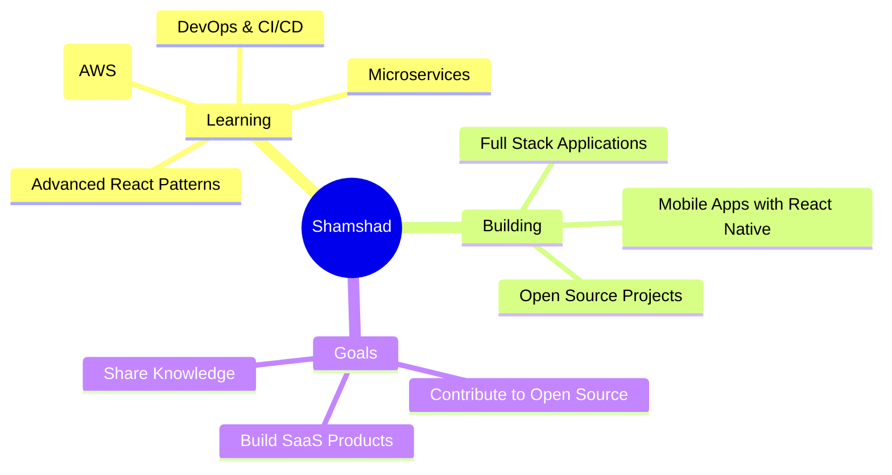

<div align="center">

<!-- Working Animated Header -->


<!-- Working Typing Effect -->


<!-- Working Profile Views Counter -->
<p align="center">
  
  
</p>

<!-- Animated Divider -->


</div>

<!-- About Me Section -->
<div align="center">

##  About Me


```javascript
const shamshad = {
    pronouns: "He" | "Him",
    location: "India 🇮🇳",
    role: "Full Stack Developer",
    languages: ["JavaScript", "PHP", "HTML/CSS"],
    technologies: {
        frontEnd: ["React", "Next.js", "Angular", "React Native"],
        backEnd: ["Node.js", "Laravel", "PHP"],
        databases: ["MongoDB", "MySQL"],
        tools: ["Git", "Linux", "VS Code"]
    },
    currentFocus: "Building scalable web applications",
    funFact: "I turn coffee into code ☕ → 💻"
};
```

</div>

&lt;!-- Animated Divider -->


&lt;!-- Skills Section -->
<div align="center">

##  Tech Stack & Tools

&lt;!-- Frontend Technologies -->
<details open>
<summary><b>🎨 Frontend Development</b></summary>
<br>
<p align="center">
  
</p>
<p align="center">
  
  
  
  
  
  
  
  
  
</p>
</details>

&lt;!-- Backend Technologies -->
<details open>
<summary><b>⚙️ Backend Development</b></summary>
<br>
<p align="center">
  
</p>
<p align="center">
  
  
  
</p>
</details>

&lt;!-- Database & Tools -->
<details open>
<summary><b>🗄️ Databases & Tools</b></summary>
<br>
<p align="center">
  
</p>
<p align="center">
  
  
  
  
  
</p>
</details>

</div>

&lt;!-- Animated Divider -->


&lt;!-- GitHub Stats Section -->
<div align="center">

##  GitHub Analytics

&lt;!-- Working Stats Cards -->
<p align="center">
  
  
</p>

&lt;!-- Working Streak Stats -->
<p align="center">
  
</p>

&lt;!-- Working Activity Graph -->


</div>

&lt;!-- Animated Divider -->


&lt;!-- Trophies Section -->
<div align="center">

##  GitHub Trophies


</div>

&lt;!-- Animated Divider -->


&lt;!-- Current Focus Section -->
<div align="center">

##  What I'm Up To



</div>

&lt;!-- Animated Divider -->


&lt;!-- 🚀 FEATURED PROJECTS SECTION - RESTORED! -->
<div align="center">

##  Featured Projects

<table>
<tr>
<td width="50%">
<h3 align="center">🚀 Awesome Web App</h3>
<div align="center">  
<a href="https://github.com/shamshadhusain3/your-project-name" target="_blank">

</a>
<br><br>
<p>


</p>
</div>
</td>
<td width="50%">
<h3 align="center">🌟 Mobile App</h3>
<div align="center">  
<a href="https://github.com/shamshadhusain3/your-mobile-app" target="_blank">

</a>
<br><br>
<p>


</p>
</div>
</td>
</tr>
<tr>
<td width="50%">
<h3 align="center">💼 E-Commerce Site</h3>
<div align="center">  
<a href="https://github.com/shamshadhusain3/ecommerce-project" target="_blank">

</a>
<br><br>
<p>


</p>
</div>
</td>
<td width="50%">
<h3 align="center">🎨 Portfolio Website</h3>
<div align="center">  
<a href="https://github.com/shamshadhusain3/portfolio" target="_blank">

</a>
<br><br>
<p>


</p>
</div>
</td>
</tr>
</table>

### 🔥 More Projects
<p align="center">
<a href="https://github.com/shamshadhusain3?tab=repositories" target="_blank">

</a>
</p>

</div>

&lt;!-- Animated Divider -->


&lt;!-- Connect Section -->
<div align="center">

##  Let's Connect

<p align="center">
<a href="https://linkedin.com/in/shamshad-husain" target="_blank">

</a>
<a href="https://instagram.com/_.shamshad._9" target="_blank">

</a>
<a href="mailto:your.email@gmail.com" target="_blank">

</a>
<a href="https://your-portfolio.com" target="_blank">

</a>
</p>

<!-- Social Media Animation -->


</div>

&lt;!-- Fun Facts Section -->
<div align="center">

##  Fun Facts

<table>
<tr>
<td>

</td>
<td>

### 💡 Quick Facts About Me:

- 🔭 Currently working on **exciting full-stack projects**
- 🌱 Learning **Cloud Technologies & DevOps**
- 👯 Looking to collaborate on **open source projects**
- 🤔 Ask me about **React, Node.js, JavaScript**
- ⚡ Fun fact: **I can debug code faster with music on! 🎵**
- 🎯 2024 Goal: **Contribute to 50+ open source projects**
- 🏆 Achievement: **Built 20+ web applications**

</td>
</tr>
</table>

</div>

&lt;!-- Quote Section -->
<div align="center">

##  Random Dev Quote


</div>

&lt;!-- Snake Animation -->
<div align="center">

##  Contribution Snake

<picture>
  <source media="(prefers-color-scheme: dark)" srcset="https://raw.githubusercontent.com/shamshadhusain3/shamshadhusain3/output/github-contribution-grid-snake-dark.svg">
  <source media="(prefers-color-scheme: light)" srcset="https://raw.githubusercontent.com/shamshadhusain3/shamshadhusain3/output/github-contribution-grid-snake.svg">
  
</picture>

</div>

&lt;!-- Support Section -->
<div align="center">

##  Support My Work

<p align="center">
<a href="https://www.buymeacoffee.com/shamshadhusain3" target="_blank">

</a>
</p>

</div>

&lt;!-- Footer -->
<div align="center">


###  Thanks for visiting! Let's build something amazing together! 

<p align="center">


</p>

**✨ "First, solve the problem. Then, write the code." – John Johnson**

</div>
