<div align="center">
  
# 👋 Hello, I'm Shamshad Husain


<p align="center">
  
  
</p>

---

### 🚀 About Me

```javascript
const shamshad = {
    location: "India 🇮🇳",
    role: "Full Stack Developer",
    passion: ["Web Development", "Mobile Apps", "Open Source"],
    currentFocus: "Building scalable web applications",
    funFact: "I debug with console.log() and I'm not ashamed! 😄"
};
```

</div>

## 🛠️ Tech Arsenal

<div align="center">

### Frontend Technologies
<p>
  
  
  
  
  
  
  
</p>

### Styling & Frameworks
<p>
  
  
</p>

### Backend Technologies
<p>
  
  
  
  
  
</p>

### Databases & Tools
<p>
  
  
  
  
</p>

</div>

## 📊 GitHub Analytics

<div align="center">
  
  
</div>

<div align="center">
  
</div>

## 🏆 GitHub Achievements

<div align="center">
  
</div>

## 📈 Contribution Graph

<div align="center">
  
</div>

## 🎯 Current Focus

```mermaid
graph LR
    A[🎯 Learning] --> B[Advanced React Patterns]
    A --> C[Cloud Architecture]
    A --> D[DevOps Practices]
    B --> E[🚀 Building]
    C --> E
    D --> E
    E --> F[Scalable Applications]
```

<div align="center">



</div>

## 🌟 Featured Projects

<div align="center">

[](https://github.com/shamshadhusain3/your-awesome-project)
[](https://github.com/shamshadhusain3/another-cool-project)

</div>

## 🤝 Let's Connect

<div align="center">

[](https://linkedin.com/in/shamshad-husain)
[](https://instagram.com/_.shamshad._9)
[](mailto:your.email@gmail.com)
[](https://your-portfolio-url.com)

</div>

## 💡 Fun Facts

<div align="center">

- 🔭 I'm currently working on **exciting full-stack projects**
- 🌱 I'm currently learning **Cloud Technologies & DevOps**
- 👯 I'm looking to collaborate on **open source projects**
- 💬 Ask me about **React, Node.js, Python, or anything tech!**
- ⚡ Fun fact: **I can code for hours with just coffee and good music! ☕🎵**

</div>

---

<div align="center">

### 💭 Random Dev Quote


### 🐍 Contribution Snake


---


**✨ "Code is like humor. When you have to explain it, it's bad." - Cory House**

</div>
